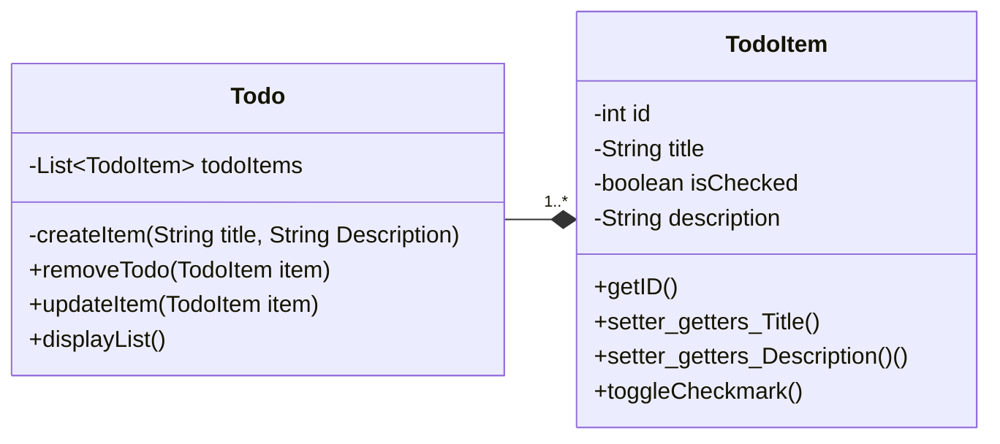

# TODO List
An interactive todo list that allows you to add and remove TODO Items. It will also let you mark an item as complete
# Designs
## Class Diagram


## Psuedo Code
### TODO Class
```pseudo
START addTodo RECEIVING title, Description
    
END

START RemoveItem

END

START UpdateItem

END
```

### TODO Class
```pseudo
START __CONSTRUCTOR RECEVING pTitle, pDescription
    Set title to pTitle
    Set description to pDescription
    Set isChecked to FALSE
END 

START toggleCheckmark 
    Toggle THIS.isChecked 
END
```
